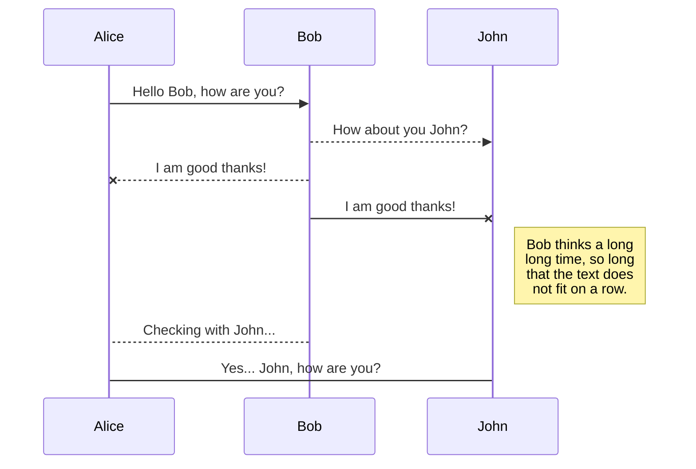

Test post with some code

HTML:

```html
<label class="control-label" asp-for="Email"></label>
```

CSharp:

```csharp
public class Test
{
	public Test()
	{

	}
}
```




<div class="mermaid">
sequenceDiagram
    loop Daily query
        Alice->>Bob: Hello Bob, how are you?
        alt is sick
            Bob->>Alice: Not so good :(
        else is well
            Bob->>Alice: Feeling fresh like a daisy
        end

        opt Extra response
            Bob->>Alice: Thanks for asking
        end
    end
</div>
